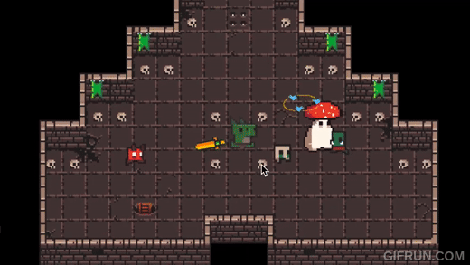

# Royal Demons
Royal Demons is a Dungeon Crawler game written in Java that won the Best Project Competition out of a total of 114 teams at Georgia Tech CS 2340 Objects and Design course during Spring 2021.

Demo Video: https://www.youtube.com/watch?v=rOLvdaMtE1Y

## Background Story:
*The Royal Kingdom once lived in harmony with the wild’s various types of creatures. Aimed for the goal of living peacefully with nature’s wildlife, the Royal Kingdom set out to bring humans and creatures together in one environment. After a century-long established kingdom of peace and prosperity, a demonized man soon realized another perspective to view these creatures, to carry out his own greedy desires. Using dark magic to possess these creatures and slowly take over the kingdom, the evil man kidnaps creatures one by one to his dungeon and uses them against the Royal Kingdom. It didn’t take long for Demon Man to acquire his new army of once-happily-living possessed creatures. After having just captured his best friend, Dino Baby journeys out in vengeance to retrieve his GF and restore balance to his kingdom.*

## Features:
- Infinitely playable maps
- Total of 9 different weapons. Each has its own normal and special attack
- 20+ types of minions
- Final boss with 2 phases
- Hidden room for you to discover
- Challenge room 

## Game Control:
- WASD to move the hero
- Mouse left click to do normal attack
- space to do power attack
- E to pick up items
- F to use items or interact with NPC
- I to show inventory
- 1 to drink health potion
- 2 to drink rage potion
- M to show game map
- P to teleport to showcase room

## Setup:
1. Clone this repo
2. Open this repo with IntelliJ IDEA IDE
3. There should be a pop-up asking if you want to load the Gradle project. Load it
4. Set the project SDK to Amazon Corretto 11.0.20
5. Run the application via Gradle! (Tasks -> application -> run)

## Acknowledgement
#### Authors
- [Alice Wang](https://www.linkedin.com/in/alice-wang-3a8300207/) 
- [Devan Moses](https://www.linkedin.com/in/devanmoses/)
- [James Johnson](https://www.linkedin.com/in/james-johnson-a767b7192/)
- [Jason Ng](https://www.linkedin.com/in/jason-ng-a1a01a1a8/)
- [Ray Hung](https://www.linkedin.com/in/ruize-hung/)

#### Asset by 0x72, aekae13, superdark, o-lobster from itch.io
- [0x72.itch.io/dungeontileset-ii](https://0x72.itch.io/dungeontileset-ii)
- [0x72.itch.io/dungeonui](https://0x72.itch.io/dungeonui)
- [aekae13.itch.io/16x16-dungeon-walls-reconfig](https://aekae13.itch.io/16x16-dungeon-walls-reconfig)
- [superdark.itch.io/16x16-free-npc-pack](https://superdark.itch.io/16x16-free-npc-pack)
- [superdark.itch.io/enchanted-forest-characters](https://superdark.itch.io/enchanted-forest-characters)
- [o-lobster.itch.io/simple-dungeon-crawler-16x16-pixel-pack](https://o-lobster.itch.io/simple-dungeon-crawler-16x16-pixel-pack)

#### FXGL
Powered by [FXGL 11.15](https://github.com/AlmasB/FXGL)

Author: Almas Baimagambetov